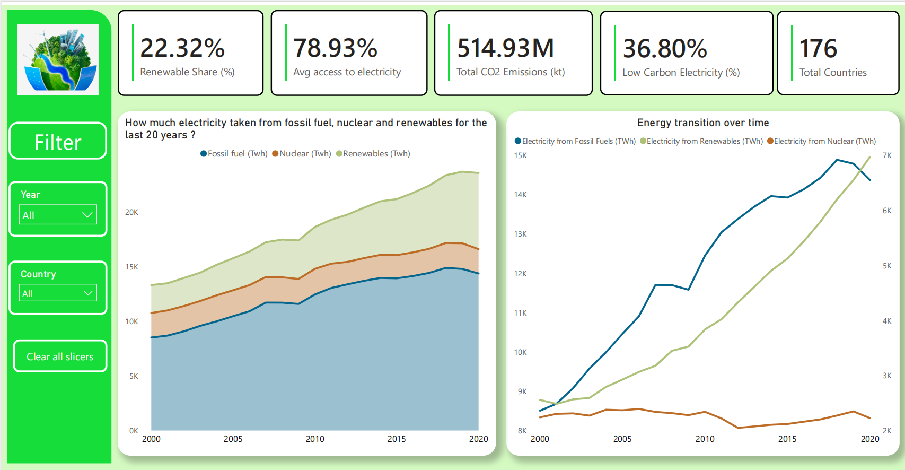
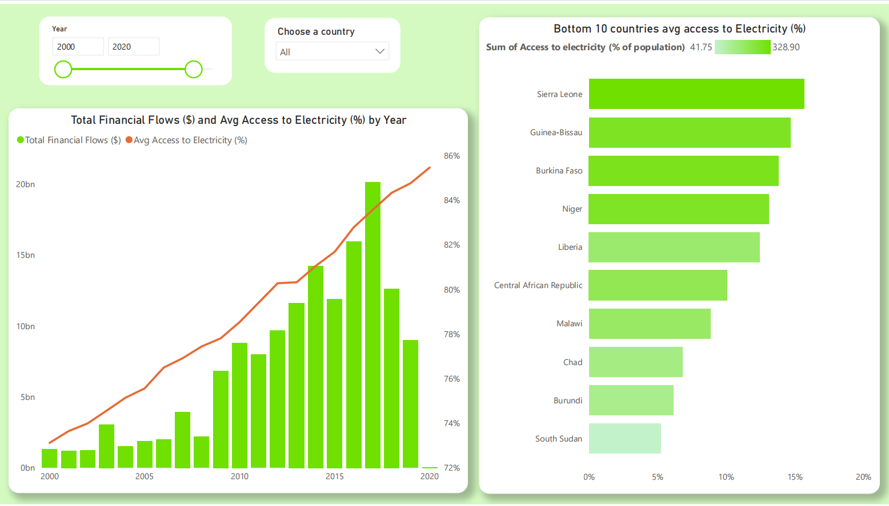
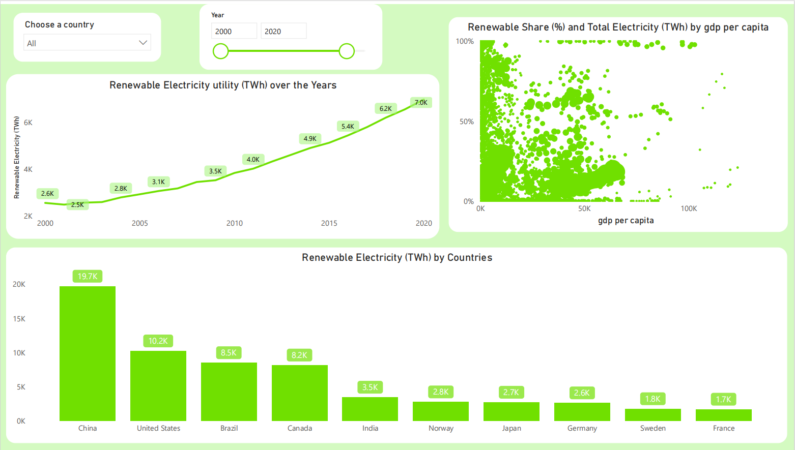
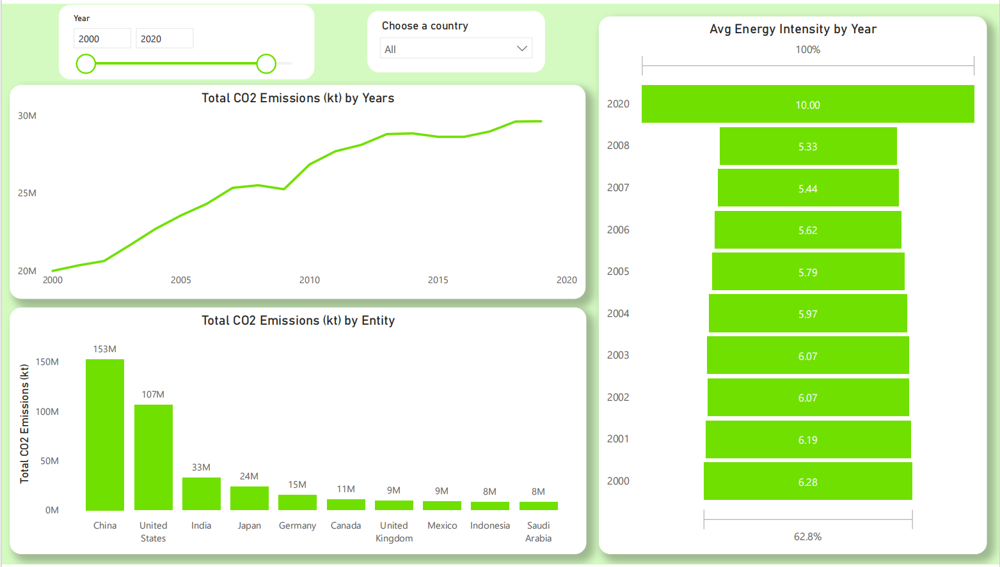

# Global Sustainable Energy & Emissions Analysis (2000–2020)

## Business Problem
Governments and organizations need long-term data-driven insights to evaluate sustainability strategies
and climate policies. This project analyzes global energy consumption and emissions data from 2000 to 2020
to identify trends, regional differences, and progress toward renewable energy adoption.

## Dataset
- Source: Public global energy & emissions dataset
- Time span: 2000–2020
- Granularity: Country-level, yearly
- Key fields: country, year, energy consumption, renewable energy share, CO₂ emissions

## Tools & Technologies
- Python (Pandas, NumPy)
- Power BI

## Data Processing (ETL)
- Collected and consolidated multi-year global energy datasets
- Cleaned missing values and standardized country names
- Normalized metrics to enable cross-country comparisons
- Modeled time-series data in Power BI for analytical reporting

## Key Insights
- Global renewable energy adoption increased steadily between 2000 and 2020
- CO₂ emissions trends varied significantly by region
- Several countries reduced emissions despite rising energy consumption
- Developing regions showed rapid renewable energy growth rates

## Business Insights & Recommendations
- Countries with higher renewable energy share demonstrated more stable emissions trends
- Long-term trend analysis highlights regions requiring stronger sustainability policies
- Comparative analysis enables benchmarking of national energy strategies
- Renewable adoption growth indicates opportunities for green investment prioritization

## Dashboard Preview

### Global Overview

### Country Comparison

### Renewable Energy Trends

### Emissions Analysis

## Outcome & Business Value
This project supports sustainability benchmarking, policy evaluation, and strategic planning by
transforming historical energy data into actionable insights.
